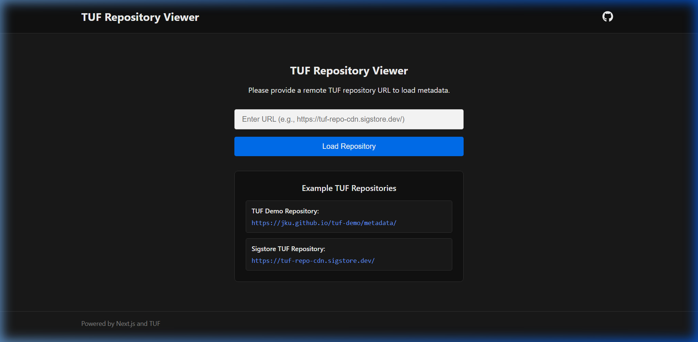
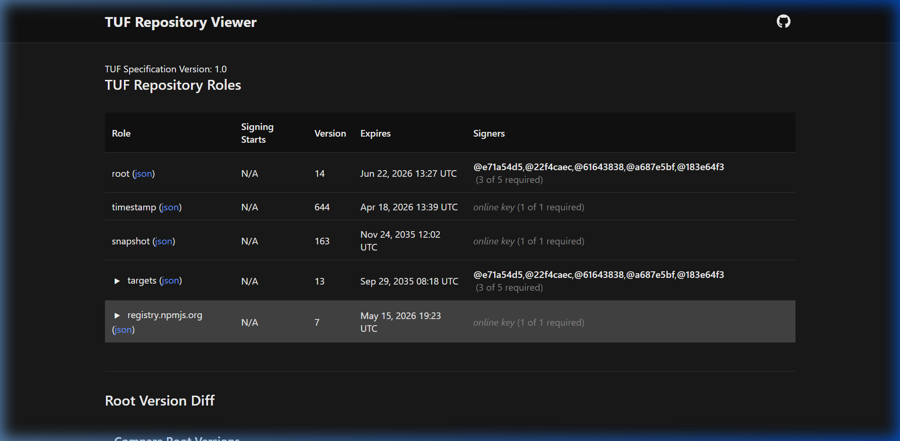

# 🔍 TUF Metadata Visualizer

The **TUF Metadata Visualizer** creates human-readable visual displays of TUF metadata repositories. It shows complex JSON files in a simple, interactive interface. Without this tool, you would need to read and understand raw JSON files across multiple documents. This visualizer uses tables, diagrams, and root.json comparison views to clearly show how different parts of the metadata connect. This makes auditing, reviewing changes, and verifying security much easier.

**🌐 Live URL:** [https://tuf-visualizer.netlify.app/](https://tuf-visualizer.netlify.app/)

## 🏗️ TUF Visualizer Integration

This project is a dedicated utility for the **Repository Service for TUF (RSTUF)** ecosystem. It allows administrators and users to verify the state of a TUF repository by connecting directly to the RSTUF metadata server. The visualizer supports remote repository URLs and provides a real-time view of trust anchors and delegations.

## 📐 Architecture Overview

The integration follows a standard production pipeline:

`RSTUF API → Worker → Storage → Metadata Server → Visualizer`

1.  **RSTUF API**: The entry point for managing the TUF repository.
2.  **Worker**: Handles the asynchronous tasks of signing and updating metadata.
3.  **Storage**: A volume or S3 bucket where the signed JSON metadata is stored.
4.  **Metadata Server**: A lightweight service (e.g., Nginx or `python -m http.server`) that serves the storage contents over HTTP/HTTPS.
5.  **Visualizer**: This Next.js application, which fetches the metadata via the Metadata Server and renders it for the user.

## 🚀 Getting Started

### Prerequisites

* Node.js 18.17.0 or later
* Docker (optional, for containerized deployment)

### Local Setup

1. **Clone the repository:**

   ```bash
   git clone https://github.com/DeshDeepakKant/TUF-Metadata-Visualizer.git
   cd TUF-Metadata-Visualizer
   ```

2. **Install dependencies:**

   ```bash
   npm install
   ```

3. **Run the development server:**

   ```bash
   npm run dev
   ```

4. **Open your browser:**

   Navigate to [http://localhost:3000](http://localhost:3000) to view the application.

---

## 🐳 Docker Deployment

The visualizer can be easily run as a Docker container.

### 1. Start the RSTUF Stack
Ensure your RSTUF API and Metadata Server are running. For local development with Docker Compose:
```bash
# In the repository-service-tuf directory
docker-compose up -d
```

### 2. Run the Visualizer
```bash
docker build -t tuf-visualizer .
docker run -p 3000:3000 \
  -e NEXT_PUBLIC_RSTUF_API=http://localhost:8080/ \
  tuf-visualizer
```

---

## ☸️ Helm Deployment

The visualizer is integrated into the RSTUF Helm-based deployment system.

### Standalone Installation
```bash
helm install rstuf-visualizer ./helm-charts/charts/rstuf-visualizer
```

### Integration with rstuf-demo
The `rstuf-demo` meta-chart includes the visualizer by default. Configuration in `values.yaml`:

```yaml
rstuf-visualizer:
  enabled: true
  env:
    NEXT_PUBLIC_RSTUF_API: "http://rstuf-api:80/api/v1/metadata/"
```

---

## 📸 Screenshots

| Dashboard Overview | Metadata Loaded View |
| :---: | :---: |
|  |  |

---

## 🔧 Environment Variables

*   `NEXT_PUBLIC_RSTUF_API`: The default TUF API URL to load metadata from.
*   `PORT`: The port on which the server runs (default: `3000`).

---

## 🤝 Contributing

Contributions are welcome! Please open issues or pull requests.

## 📬 Contact

Join our Slack community: [Slack Channel](https://app.slack.com/client/T08PSQ7BQ/C08FNCGB5N2)

